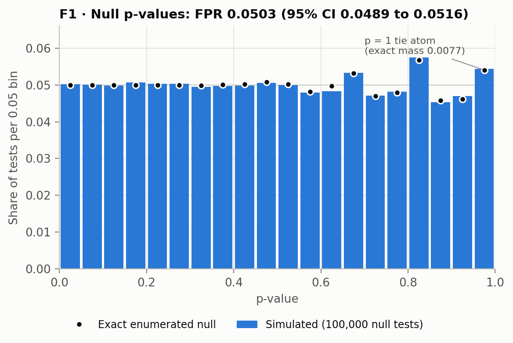
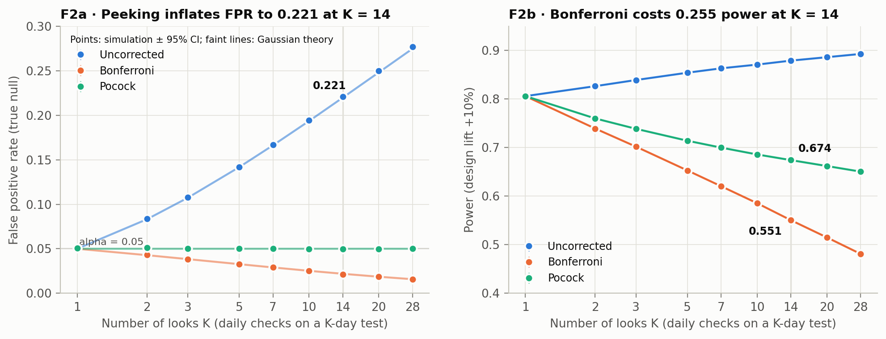
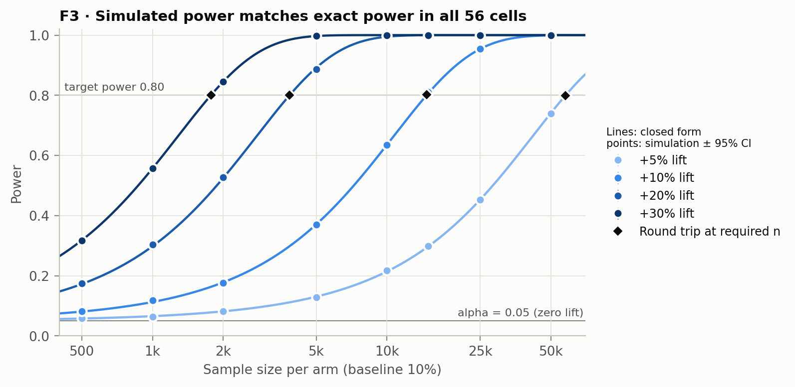
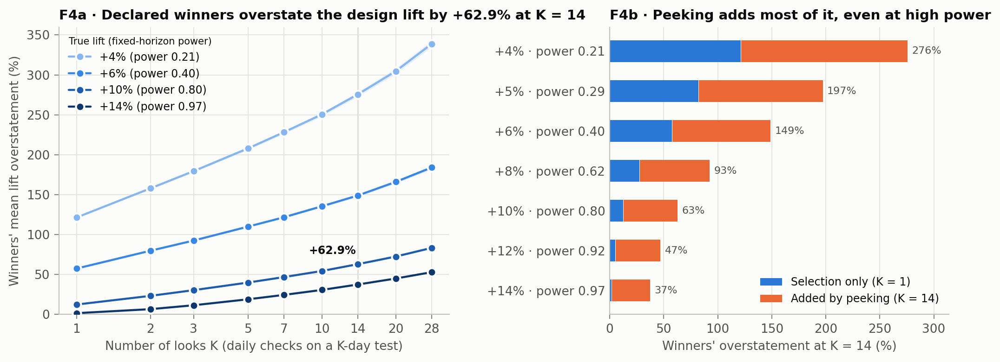

# Figure captions

Generated by `python -m absim.plots` from `results/`. Do not edit by hand.

## F1_null_calibration

F1. Null p-values at the design point (p = 0.1, n = 14,800/arm). Empirical FPR at alpha = 0.05 is 0.0503 (95% CI 0.0489 to 0.0516); the exact size is 0.05001. The p-values match the exact enumerated null (KS D = 0.0020, p = 0.83) but not U(0,1) (D = 0.0079), purely because ties x_t = x_c put an atom of mass 0.0077 at p = 1 (simulated 0.0079).

## F2_peeking

F2. Stopping at the first look with p < 0.05 raises the false positive rate from 0.0510 at K = 1 to 0.221 at K = 14 (Gaussian recursive-integration theory 0.220) and 0.277 at K = 28. Bonferroni holds FPR at 0.0215 but cuts power from 0.806 (fixed horizon) to 0.551, a paired cost of -0.255 (95% CI -0.259 to -0.251). A calibrated Pocock boundary keeps FPR at 0.0497 with power 0.674, +0.124 over Bonferroni (95% CI +0.121 to +0.127). Fixed-horizon power 0.8059 in this seed is 2.6 SE above the closed form 0.8013; a 10-seed check averaged 0.8015.

## F3_power

F3. Power of the pooled z-test vs sample size. Across all 56 cells (7 lifts x 8 sizes, 20,000 trials each) simulation agrees with exact enumerated power (smallest per-cell binomial p = 0.016 against a Bonferroni threshold of 0.00018; chi-square p = 0.72). The closed form is never more than 0.0012 from exact (worst at +30%, n = 2,000), and the largest simulated minus closed-form gap at n >= 1,000 is 0.0053, within MC error. At the sample sizes returned by required_sample_size, simulated power is 0.7991 to 0.8017 for relative MDEs of 5% to 30%. Lifts +2.5% and +15% are omitted from the plot for legibility and are in results/study3_power_grid.csv.

## F4_winners_curse

F4. Relative overstatement of the true lift by tests that stop early and declare the treatment the winner. At the design point (+10%, K = 14) winners overstate the effect by +62.9% (95% CI +62.2 to +63.7): +12.4% is selection alone (K = 1) and +50.5% (bootstrap CI +49.8 to +51.3) is added by peeking. The same winners run to the full horizon overstate by only +7.9%. Selection bias fades with power (+1.6% at power 0.97) but peeking bias does not: the same lift still shows +37.5% at K = 14. Under the null at K = 14, 11.1% of tests declare a winner with mean reported lift 0.0175. Panel a shows 4 of 7 non-zero lifts; all are in results/study4_winners_curse.csv.
